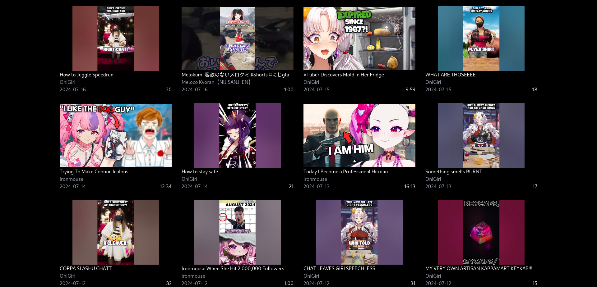

# yt-channel-watcher

## Table of contents

- [About](#about)
- [How to use](#how-to-use)
- [Contributing](#contributing)
- [License](#license)

## About

yt-channel-watcher is a program that call [yt-dlp](https://github.com/yt-dlp/yt-dlp) to fetch channels informations (videos&shorts) and then generate a static HTML from the video data.  
I really liked the [holodex](https://holodex.net/) project, but it only/mostly tracks vtuber clippers. I just wanted to see the vtubers' own content.  
This project is not limited to just to the vtuber community, you can use it to fetch any youtube channel.

## How to use

[See HOWTOUSE.md](HOWTOUSE.md)

## Contributing

[See CONTRIBUTING.md](CONTRIBUTING.md)

## License

The project is licensed under the MIT licence.
